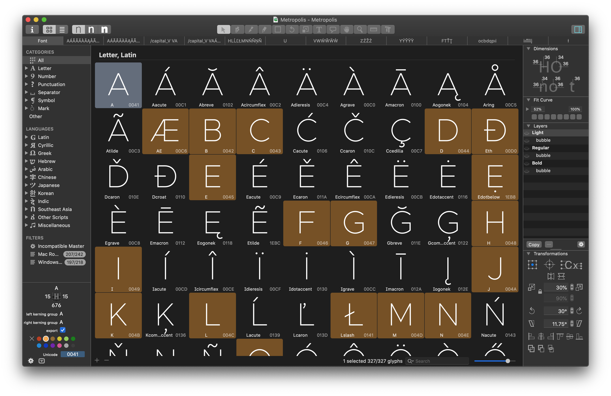
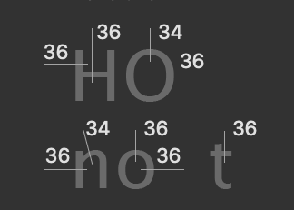
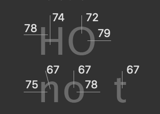
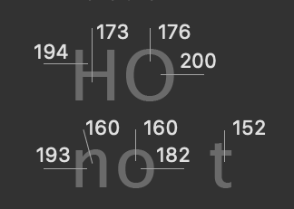
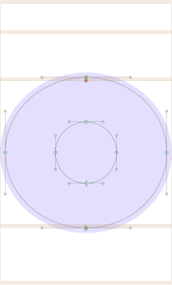
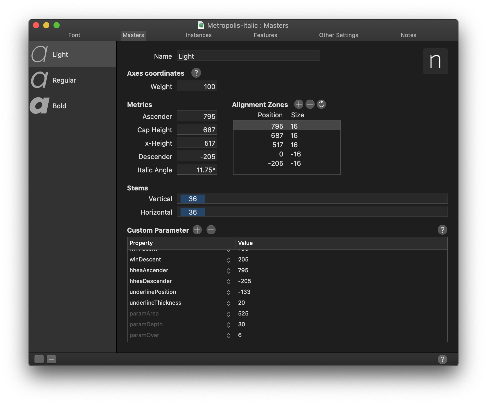
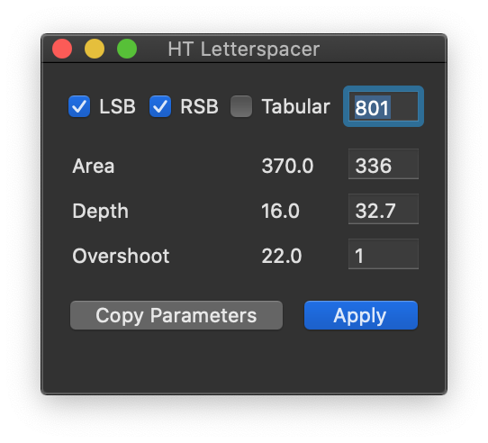
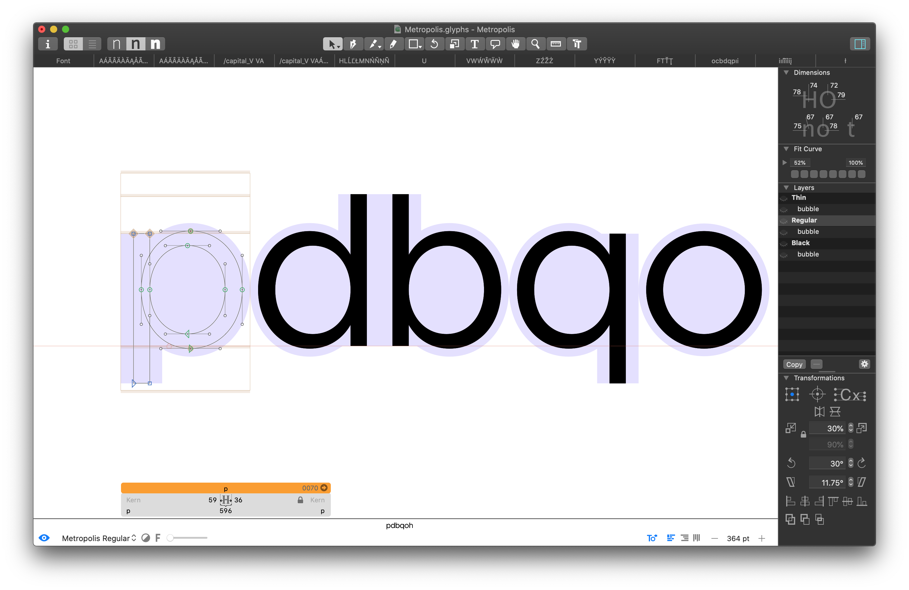
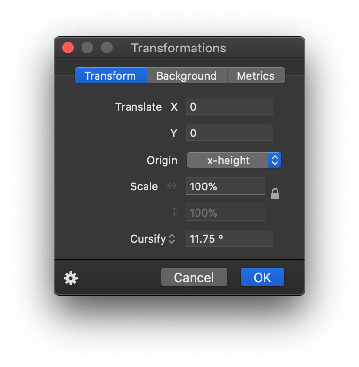
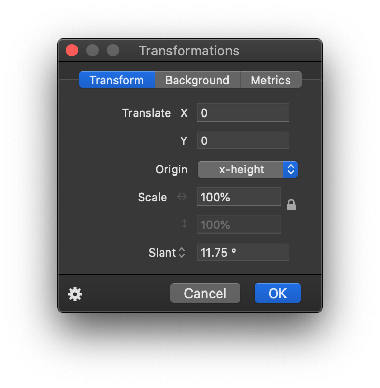

# <a name="documentation"></a> Documentation

## <a name="contents"></a> Table of Contents

* [Documentation](#documentation)
	* [Table of Contents](#contents) 	
	* [Workflow](#workflow)
	* [Metrics](#metrics)
		* [Italics](#italics)
		* [Dimensions/stroke width](#dimensions)
		* [Alignment Zones](#alignmentzones)
	* [HT Letterspacer](#htletterspacer)
	* [BubbleKern](#bubblekern)
	* [Cursify](#cursify)
	* [Release process](#releaseprocess)
	* [OpenType features](#features)
	* [Export formats](#exportformats)
* [Future plans](#futureplans)
* [Editing without Glyphs](#alternatives)
* [Submitting a PR](#PRs)

## <a name="workflow"></a> Workflow



The design source (`Sources/*.glyphs`) was originally drawn in Glyphs ([https://glyphsapp.com](https://glyphsapp.com)), a macOS-only type design application. Building the font from that source — static instances, OpenType/TrueType/UFO/webfont exports, and variable fonts — does not require Glyphs and runs cross-platform via `fontmake` (see `Sources/build.sh`); editing the outlines themselves still requires either Glyphs or another tool that can open/save `.glyphs`/UFO files (see [Editing without Glyphs](#alternatives) below).

The two plugins the original source's spacing and kerning setup were built around are HT Letterspacer ([https://huertatipografica.github.io/HTLetterspacer/)](https://huertatipografica.github.io/HTLetterspacer/) and BubbleKern ([http://glyphsextensions.com/bubblekern/](http://glyphsextensions.com/bubblekern/)). More on both below.

## <a name="metrics"></a> Metrics

Given an **em square of 1000**, the metrics for Neat Fine Sans are as follows:

| | Value
--- | -----
Ascender  | 795
Cap Height  | 687
x-Height  | 517
Descender  | -205

### <a name="italics"></a> Italics

The italics angle is universally **11.75°**.

### <a name="dimensions"></a> Dimensions or 'stroke width'

The dimensions are as follows:

Light | Regular | Black
--- | --- | ---
 |  | 

Diagonal strokes (e.g. the 'x') generally start from an elongated vertical bar matching the stem width of 'n', then get rotated to the desired angle and adjusted by eye — there isn't a fixed formula like 'stroke width y at a degree of z'.

### <a name="alignmentzones"></a> Alignment Zones



Across all 6 masters (3 weights × roman/italic), the alignment zones are +/- a value of **12**, which works well for this style of sans typeface at an em square of 1000.

The glyph set currently has 327 outlines, drawn directly in Glyphs rather than from prior freehand sketches.

## <a name="htletterspacer"></a> HT Letterspacer

HT Letterspacer is a tool that automatically calculates the appropriate left and right bearing on any glyph, essentially doing the spacing part of the design automatically.

In order for this to work, the plugin requires a few parameters, which can be found in the custom parameters in the masters tab of the font info window, namely `paramArea`, `paramDepth`, `paramOver`.



Checkout [https://huertatipografica.github.io/HTLetterspacer/)]() for a much more thorough explanation of this tool. The values currently in use:

| | Thin | Regular | Black 
--- | ---- | ------- | -----
`paramArea` | 350 | 310 | 370
`paramDepth` | 5 | 7 | 16
`paramOver` | 2 | 9 | 22

These were arrived at through iterative adjustment rather than a fixed formula.

In addition to this, each *.glyphs file needs a corresponding autospace file. For instance:

```
./NeatFineSans.glyphs
./NeatFineSans_Black_autospace.py
./NeatFineSans_Regular_autospace.py
./NeatFineSans_Thin_autospace.py
```

and

```
./NeatFineSans-Italic.glyphs
./NeatFineSans-Italic_Black_autospace.py
./NeatFineSans-Italic_Regular_autospace.py
./NeatFineSans-Italic_Thin_autospace.py
```

This requires a version of HT Letterspacer that supports per-master/per-weight values. The param values define the overall weight (and/or rhythm) of the typeface, while the autospace file defines ratios between things like uppercase, small caps, lowercase, numbers, etc.

Once both the plugin and these settings are correctly set up, the tool can be invoked either with its UI or without; running it without the UI (so settings aren't manually overridden) is recommended, and can be repeated with **Option + Command + R**.



When making spacing adjustments, it's key to run the tool multiple times — glyphs coalesce into their eventual spacing over several passes.

## <a name="bubblekern"></a> BubbleKern



Kerning is defined using BubbleKern ([http://glyphsextensions.com/bubblekern/](http://glyphsextensions.com/bubblekern/)) rather than manually, since manual kerning would be impractical to redo each release. Think of the 'bubbles' as the shaped physical block a piece of metal type would be mounted on — contoured outside the glyph's perimeter to let glyphs align tightly.

Each outline layer needs a corresponding 'bubble' layer (see right hand side 'Layers' pane). It is crucial that the width of corresponding layers match (e.g. the 'Thin' layer and its immediately following 'bubble' layer) for this to work correctly.

Once defined/drawn for every glyph, BubbleKern is then run using `NeatFineSans BubbleKern Pairs.txt`. **Any kern pairs must go in this file/BubbleKern must only be run using this file.**

Offset values used when drawing the kern bubbles: 56, 53 & 50 for Thin, Regular & Black, respectively — chosen to honor the values already established by HT Letterspacer.

## <a name="cursify"></a> Cursify

The italics are produced largely with Glyphs' 'Cursify' tool, which yields better results than simply slanting the regular/normal glyph shapes — generally by slanting vertical bars and cursifying the rest.

Cursify | Slant
--- | ---
 | 

## <a name="releaseprocess"></a> Release process

1. Remove all kerning
2. Draw
3. Space
4. Draw BubbleKern bubbles 
5. Re-Run BubbleKern (use `../Sources/NeatFineSans BubbleKern Pairs.txt`)
6. Export 
7. Commit 
8. Create release tag

## <a name="features"></a> OpenType features

`ss01` (labelled "Single-storey a") and `salt` substitute a single-storey, geometric
alternate for `a` and its accented forms: `a aacute abreve acircumflex adieresis
agrave amacron aogonek aring atilde`. The alternate is a stem plus a circular bowl,
where the default is a double-storey design.

## <a name="exportformats"></a> Export formats

After running BubbleKern, exports are generated for OpenType, TrueType, UFO, WOFF, WOFF2, and variable fonts (`wght` axis, 100–900) — see `Sources/build.sh`.

# <a name="futureplans"></a> Future Plans

## Small Caps

Additional metrics likely need to be defined before this can go ahead. There's an open PR for some caps that hasn't been reviewed, and it's unclear whether spacing and/or kerning has been appropriately set.

## Rounded

A rounded version, adjusting strokes an additional 12 points at cap ends.

## Slab/Serif

Not yet scoped out, but could also serve as preliminary work for a possible monospaced version.

## Monospaced

As above.

## Micro / Text / Display

Would likely require a substantial redrawing effort — the current metrics work reasonably well as-is, but separating for different display sizes would need a rethink of the core metrics (and spacing).

# <a name="alternatives"></a> Editing without Glyphs

Glyphs is macOS-only. If you can't run it, the UFO instances in `Fonts/UFO/` (or the `.glyphs` sources, which `glyphsLib` can read/write from Python on any OS) are the best starting point for edits. To propose a glyph change, raise an issue with your modified file attached rather than opening a PR directly against the `.glyphs` source, so a maintainer can translate it into a proper commit.

# <a name="PRs"></a> Submitting a PR

PRs should be small and isolated — easily described and understood from the PR itself.

When saving the file for a PR, close all other open tabs and leave one remaining with the added/modified glyphs visible, to make review easier.

Please:

- Run the autospacing on your modified/created glyph before submitting as a PR
- Add relevant bubble kern to any modified/created glyph and set up as described above
- Apply to all weights and both normal/italic where appropriate

Please do not:

- Modify any autospacing settings
- Modify any other kern bubbles
- Set manual kerns (or run the kerning tool at all)
- Modify any glyphs not related to your changes

As a general rule, a small isolated commit should equal a small isolated PR.
